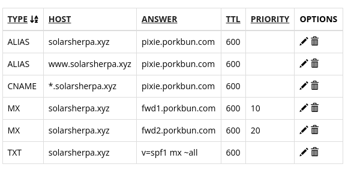

# How to create a website ?

## Step 1 - getting a domain name

TODO

## Step 2 - getting a virtual private server (VPS) and initial setup

## Step 3 - connecting the domain name to vps.

The main idea is to set the A records to point to your VPS.

I followed the page provided by my name registrar ( the chaps who sold you the web domain name) Porkbun. [The details can be found here](https://kb.porkbun.com/article/54-how-to-use-a-records-to-point-your-domain-at-a-web-host).

The basic steps are :

1. find existing DNS records link
2. remove existing DNS records for ALIAS and CNAME ( the image below is what I had as default)

3. Add a "A - Address record" once - in this case, the host is "www". The address is the IP address of the VPS

4. Add an another address record "A - address record" - in this case, leave the host blank. The address is the same as that of the VPS.
