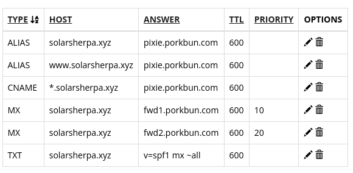

# Initial setup for creating a website

## Step 1 - getting a domain name

TODO

## Step 2 - getting a virtual private server (VPS) and initial setup

Buy a cheap VPS from somewhere. The best deal I found was from contabo.de - i got their absolute cheapest VPS. follow their steps and when you are done, you should get an email with the IP adrress of the VPS ( the password is typically set at the time of signup + purchase). In contabo, I could choose in advance the OS i wanted and I chose Ubuntu 20.04

1. first login

```
ssh root@your_server_ip
```

2. it is a good idea to create a user and _NOT_ operate from root.

```
adduser johndoe
```

3. The new user should still have access to sudo priviliges

```
adduser -aG sudo johndoe
```

4. pre-step: allow firewall (ufw) to keep ssh ports open

```
ufw allow OpenSSH
```

5. main-step: enable firewall

```
ufw enable
```

6. logout - vps bare setup is done !

7. nice to have - setup passwordless access to ssh services.

## Step 3 - connecting the domain name to vps.

The main idea is to set the A records to point to your VPS.

I followed the page provided by my name registrar ( the chaps who sold you the web domain name) Porkbun. [The details can be found here](https://kb.porkbun.com/article/54-how-to-use-a-records-to-point-your-domain-at-a-web-host).

The basic steps are :

1. find existing DNS records link
2. remove existing DNS records for ALIAS and CNAME ( the image below is what I had as default)



3. Add a "A - Address record" once - in this case, the host is "www". The address is the IP address of the VPS

4. Add an another address record "A - address record" - in this case, leave the host blank. The address is the same as that of the VPS.
