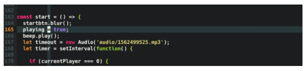

# VIM: tips and tricks

## List of commands for setting up VIM

**NOTE :** you can run this commands inside VIM with a ":" in the beginning **OR** store these commands in (.vimrc) in your home folder.

Source:

- [random googling](https://linuxhint.com/configure_vim_vimrc/)
- [freecodecamp](https://www.freecodecamp.org/news/vimrc-configuration-guide-customize-your-vim-editor/)

1. show line number

```
set number
```

2. enable syntax highlighting

```
syntax on
```

3. enable auto indentation

```
set autoindent
```

4. for fortran f90 files

```
let b:fortran_fixed_source=0
```

4. replacing tab with white space: When you insert tabs into your codes and save it and send it to someone else, he/she must use the same tab size as you did. Otherwise, the code would look very ugly.

```
set expandtab
```

5. set cursor lines and columns

```
set cursorline
set cursorcolumn
```

This is how it looks like:


